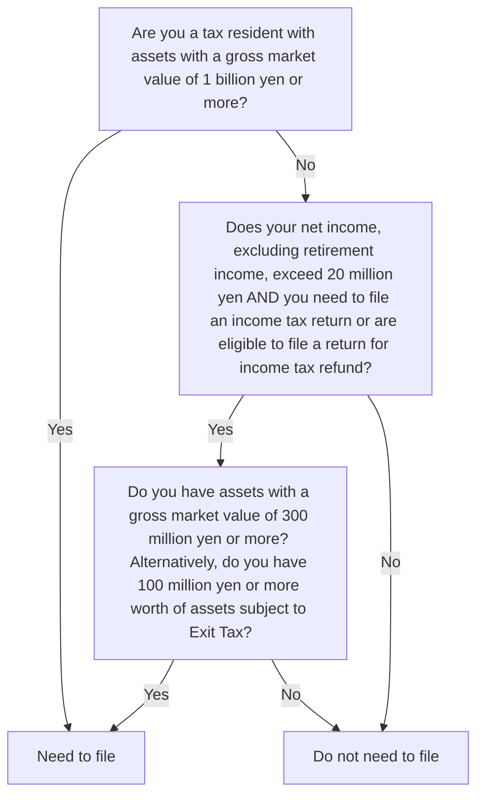

# Asset Reporting

Separate from filings for income/gifts/inheritance, there are some reports that need to be filed about your assets if you meet the requirements.

## Report of Foreign Assets

### Official name

In Japanese, it is 国外財産調書. This report was also formerly often translated as Overseas Asset Report (OAR) in material published by accounting firms. The NTA's English translation is, however, Report of Foreign Assets (RFA).

### Outline

The RFA is an obligation to declare assets located outside of Japan for [tax residents](https://japanfinance.github.io/tax/income/#tax-residency) (other than [non-permanent tax residents](https://japanfinance.github.io/tax/income/#non-permanent-tax-residents)), if they have a value of 50 million yen or more, as of December 31st of the previous year.

The deadline to file is the last day of June (if this is a weekend, then the following Monday).

### References

* [No.7456 国外財産調書の提出義務](https://www.nta.go.jp/taxes/shiraberu/taxanswer/hotei/7456.htm)
* Presentation documents in English from [PWC (2015)(pdf)](https://www.pwc.com/gx/en/hr-management-services/newsletters/global-watch/assets/pwc-new-japanese-assets-liabilities-reporting-requirement.pdf) and [KPMG (2013)(pdf)](https://assets.kpmg.com/content/dam/kpmg/pdf/2016/07/jp-overseas-assets-report-20131126e.pdf) Beware that those have outdated information such as the filling deadline of March in the 2015 PDF (it is now end of June).

### Who needs to file

[Tax residents](https://japanfinance.github.io/tax/income/#tax-residency) (other than [non-permanent tax residents](https://japanfinance.github.io/tax/income/#non-permanent-tax-residents)) whose overseas assets have a market value of JPY 50 million or more on December 31st of the previous year (regardless of whether the individual is required to file a tax return).

### Tax and cost

The obligation to file does not generate specific tax or submission costs.

### Penalties for failure to file

Please note that if the relevant foreign country exchange financial data with Japan, the NTA likely already have access to your foreign financial accounts. This is part of automated exchange under the [CRS program (pdf)](https://www.nta.go.jp/taxes/shiraberu/kokusai/crs/pdf/02en.pdf). CRS does not include other type of assets (material, real estate) that are in the scope of OAR.

In addition, penalties for failure are :

According to [the statute](https://elaws.e-gov.go.jp/document?lawid=409AC0000000110#Mp-At_10):

> 正当な理由がなくて国外財産調書をその提出期限までに税務署長に提出しなかったときは、その違反行為をした者は、一年以下の懲役又は五十万円以下の罰金に処する。ただし、情状により、その刑を免除することができる.

In other words, the penalty for not filing "without good justification" is up to one year imprisonment or a fine of up to 500,000 yen. However, the statute explicitly allows for the penalty to be waived. In practice, I expect penalties are very unlikely to be imposed in cases where the taxpayer clearly wasn't aware of their obligation or just forgot to file it, etc. Penalties are most likely reserved for cases where (1) the taxpayer clearly had the intention to evade tax by hiding assets and/or (2) the NTA repeatedly asked the taxpayer to file the report and the taxpayer repeatedly refused to file it. ([comment source](https://www.reddit.com/r/JapanFinance/comments/1afoouk/comment/koe7jxm/))

### Valuation

Values must be declared as of December 31st of the previous year. Market values at that date should be used. Use the TTB rate on December 31 for converting foreign currency to JPY.

### Submission

You can [use the e-tax desktop software, use commercial software](https://www.reddit.com/r/JapanFinance/comments/1arcnpm/how_do_you_create_overseas_asset_report_via_etax/), or fill out the PDF on the NTA page and drop or mail the paper to your tax office.

## Report of Assets and Liabilities

### Official name

In Japanese, it is 財産債務調書. Official NTA English material refers to this as the Report of Assets and Liabilities, but documents published by accounting firms have often called it the Assets and Liabilities Report (ALR).

### Outline

The Report of Assets and Liabilities is a report of all your assets and liabilities as of December 31 of the previous year, if you meet the reporting requirements (see the "Who needs to file" section).

If you need to file both the Report of Foreign Assets and the Report of Assets and Liabilities, you can exclude details of items included in your RFA from the ALR, except for the market value of the assets.

The deadline to file is the last day of June (if this is a weekend, then the following Monday).

### References

* [No.7457 財産債務調書の提出義務](https://www.nta.go.jp/taxes/shiraberu/taxanswer/hotei/7457.htm)

### Who needs to file

See the following flowchart. All evaluations of assets' value are as of December 31 of the prior year. Asset valuations do not consider liabilities for determining whether the reporting threshold is met.

See [Exit Tax](https://japanfinance.github.io/tax/other/#exit-tax) for info on which assets are subject to the Exit Tax.

See [here](https://japanfinance.github.io/tax/income/returns/#who-must-file) for who must file an income tax return.

### Tax and cost

The obligation to file does not generate specific tax or submission costs.

### Penalties for failure to file

In general, there is no penalty for not filing. However, if you file the Report of Assets and Liabilities on time, you can receive a 5% reduction in the penalty for failing to report income or inheritance related to an asset or liability included on your Report of Assets and Liabilities. To further discourage non-filers, there is an increased 5% penalty for unreported income from assets or liabilities that should have been reported on your Report of Assets and Liabilities but were not reported, or when your filing of the report including such assets/liabilities is late.

### Valuation

Values must be declared as of December 31st of the previous year. Market values at that date should be used. When converting foreign currency to JPY, the TTB rate on December 31 should be used for assets, and the TTS rate should be used for liabilities.

### Submission

Similar to the Report of Foreign Assets, this can be submitted using e-tax or as a hard copy to your local tax office.
